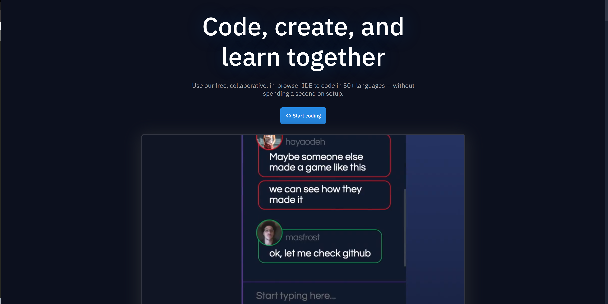
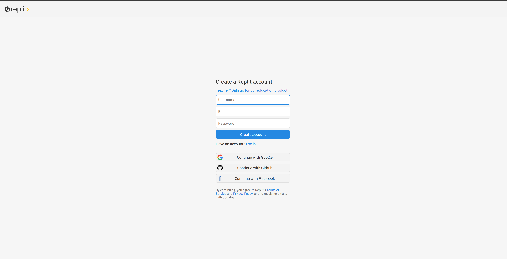
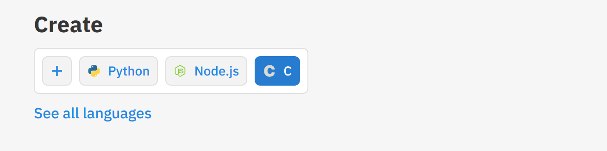
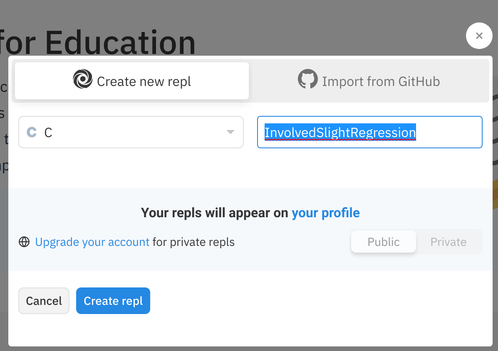
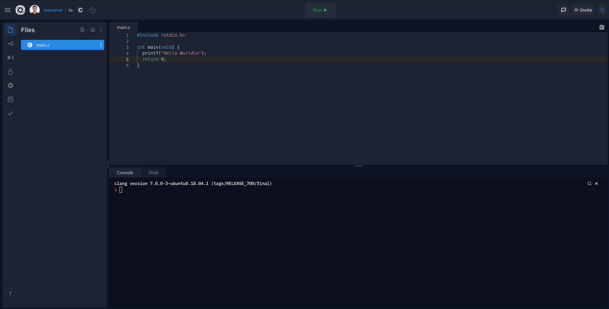
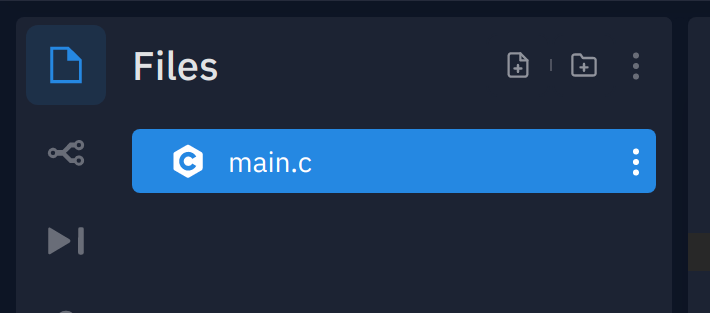
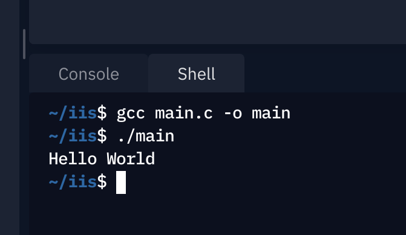

[`Introducción a la Ingeniería de Software`](../../README.md) > [`Laboratorio 1`](../README.md) > Ejemplo 1

## Ejemplo 1: Configuración de Repl.it

### 1. Objetivos :dart:

- Configurar un entorno para __C__ en __Repl.it__.

### 2. Requisitos :clipboard:

- Dispositivo con conexión y navegador de Internet.

### 3. Desarrollo :rocket:

> **NOTA:** Si te sientes cómoda(o) programando con otra herramienta, puedes usarla sin ningún problema.

1. Ingresa a la plataforma usando la url [https://replit.com/](https://replit.com/).

   

1. Da clic en el botón **`Sign up`**.

   

   __Sugerencia:__ Crear la cuenta usando su cuenta institucional (Google).

1. Cerrar el tutorial inicial y ubicarse en la sección **Create**. Dar clic en el ícono de __C__.

   

1. Introducir un nombre de proyecto.

   

   __Sugerencia:__ Crear el proyecto con un nombre intuitivo.

1. Esperar que termine de configurarse la herramienta. Al finalizar se mostrará una ventana similar a esta.

   

   Se crea un programa `main.c` por defecto, sin embargo puedes añadir tantos programas como quieras precionando el botón `+` ubicado en la sección **Files**.

   

   La manera de ejecutarlos, es usar la pesataña **Shell** que se ubica abajo. Por ejemplo, para este programa puedes escribir:

   ```bash
   > gcc main.c -o main
   > ./main
   ```

   

__Con esto estamos listos para escribir programas.__

[`Volver`](../README.md)
