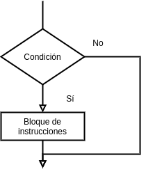

[`Introducción a la Ingeniería de Software`](../README.md) > `Laboratorio 2`

## Laboratorio 2: Repaso de Estructuras de Decisión


### 1. Objetivos :dart:

1. Recordar el concepto de flujo de ejecución de un programa y de estructura de control.
1. Recordar y ejemplificar el uso de las estructuras de decisión `if` (en todas sus variantes) y `switch` del lenguaje __C__.

### 2. Contenido :blue_book:

---


#### <ins>Flujo de Ejecución de un Programa y Estructuras de Control</ins>

- Se denomina flujo de ejecución de un programa al orden de ejecución de las instrucciones que forman parte del cuerpo de un programa. 

- Las estructuras de control son una característica básica que usan algunos lenguajes para modificar el flujo de un programa.

- Hay casos en los que el flujo de ejecución de un programa debe realizar determinadas tareas cuando se cumple una condición. En otras ocasiones debe repetir un conjunto de instrucciones un número determinado de veces. Las estructuras de Control permiten modificar el flujo de ejecución de un programa dependiendo del estado de las variables de un programa.

- Las estructuras de control básicas de __C__, se pueden clasificar en estructuras de decisión, de repetición y de salto.

   - **Decisión.** Permiten decidir si se ejecuta un bloque de instrucciones o no.

       **if, if-else, if-else-if, switch**

   - **Repetición.** Permiten ejecutar un bloque de instrucciones muchas veces. *Hablaremos de estas estructuras la próxima sesión.*

      **while, do-while, for**

   - **Salto.** Permiten dar un salto y continuar con la ejecución de un programa en un punto distinto de la siguiente instrucción secuencialmente hablando. *No hablaremos de estas estructuras en este curso.*

      **break, continue**

---

#### <ins>Estructura de Decisión `if`</ins>

- Es una estructura de decisión, evalúa una condición dada y realiza una serie de acciones dependiendo de la misma. Existen, en general, tres variantes de esta estructura.

- Una estructura `if` tiene la siguiente sintaxis:

   ```c
   if (condición)
   {
      bloque-de-instrucciones
   }
   ```

   

- Una estructura `if-else` tiene la siguiente sintaxis:

   ```c
   if(condición)
   {
      bloque-de-instrucciones
   } else 
   {
      bloque-de-instrucciones
   }
   ```

   

- Una estructura `if-else-if` tiene la siguiente sintaxis:

   ```c
   if (condición)
   {
      bloque-de-instrucciones
   } else if (condición)
   {
      bloque-de-instrucciones
   } else if (condición)
   {
      bloque-de-instrucciones
   }
   ...
   else
   {
      bloque-de-instrucciones
   }
   ```

   Esta última es la forma general.

[**`Ejemplo 1`**](ejemplo01/README.md) [**`Actividad 1`**](actividad01/README.md)

---

#### <ins>Estructura de Decisión `switch`</ins>

- Es una estructura de decisión múltiple que permite decidir entre un bloque de instrucciones a partir de una serie de casos. Tiene la siguiente sintaxis:

```c
switch(expresion)
{
   case valor1:
      instrucciones
      break;
   case valor2:
      instrucciones
      break;
   ...
   default:
      instrucciones
      break;
}
```


<br/><br/>

[**`Ejemplo 2`**](ejemplo02/README.md) [**`Actividad 2`**](actividad02/README.md)

---

### 3. Ejercicios propuestos :memo:

[**`Ejercicios Laboratorio 2`**](ejercicios/README.md)

<br/>

[`Anterior`](../laboratorio01/README.md) | [`Siguiente`](../laboratorio03/README.md)
