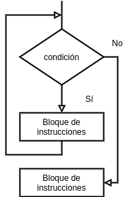
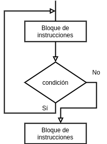

[`Introducción a la Ingeniería de Software`](../README.md) > `Laboratorio 3`

## Laboratorio 3: Repaso de Estructuras de Repetición


### 1. Objetivos :dart:

1. Recordar y ejemplificar el uso de las estructuras de repetición `while`, `do-while` y `for` del lenguaje __C__.

### 2. Contenido :blue_book:

---

#### <ins>Estructuras de repetición</ins>

- Se componen, en general, de cuatro partes: (1) la inicialización, (2) la condición, (3) el bloque de instrucciones y (4) la actualización.

   - **Inicialización**: Permite inicializar la estructura. Consiste en la declaración e inicialización de la variable de control.

   - **Condición**: Se evalúa para determinar si se continúa ejecutando el bloque de instrucciones o no. Dependiendo del tipo de estructura que se utilice, la condición se comprueba antes o después de realizar cada iteración.

   - **Bloque de instrucciones**: Conjunto de instrucciones que se ejecutan dentro de cada estructura.

   - **Actualización**: Modificación de la variable de control de la estructura. Por lo general, se realiza al finalizar la ejecución del bloque de instrucciones.

---

#### <ins>Estructura de Repetición `while`</ins>

- Permite ejecutar un bloque de instrucciones de acuerdo a una condición. Nos auxiliamos, en general, de variables de control para controlar la ejecución de la estructura. Nuestro principal apoyo son los *operadores de incremento y decremento* y los *operadores de asignación compuestos*.

- Una estructura `while` tiene la siguiente sintaxis:

   ```c
   <inicialiación>

   while(<condición>)
   {
      <bloque-de-instrucciones>
      <actualización>
   }
   ```

   

[**`Ejemplo 1`**](ejemplo01/README.md) [**`Actividad 1`**](actividad01/README.md)

---

#### <ins>Estructura de Repetición `do-while`</ins>

- Ejecuta el bloque de instrucciones al menos una vez.

- Después comprueba la condición y repite el bloque de condiciones mientras la condición sea verdadera. 

- Un `do-while` tiene la siguiente sintaxis:

```c
<inicialiación>

do
{
   <bloque-de-instrucciones>
   <actualización>
} while (<condición>);
```



[**`Ejemplo 2`**](ejemplo02/README.md) [**`Actividad 2`**](actividad02/README.md)

---

#### <ins>Estructura de Repetición `for`</ins>

- Repite el bloque de inestrucciones mientras la condición sea verdadera.

- Es un caso particular de `while`.

- Se sugiere usarlo cuando se sabe el número de veces que se debe repetir el bloque de instrucciones.

- Un `for` tiene la siguiente sintaxis:

```c
for (<inicialiación; <condición; <actualización>)
{
   <bloque-de-instrucciones>
}
```


[**`Ejemplo 3`**](ejemplo03/README.md) [**`Actividad 3`**](actividad03/README.md)

---

#### <ins> Uso de las estructuras de repetición</ins>

- Se recomienda usar la estructura `while` cuando no se sabe el número de veces que se va a repetir el bloque de instrucciones.

- Se recomienda usar la estructura `do-while` cuando el bloque de instrucciones se debe ejecutar al menos una vez.

- Se recomienda usar la estructura `for` cuando se sabe el número de veces que se va a repetir el bloque de instrucciones. Es útil cuando se conoce el valor inicial para la variable de control y además es necesario usar una expresión aritmética para actualizar esa variable.

---

### 3. Ejercicios propuestos :memo:

[**`Ejercicios Laboratorio 3`**](ejercicios/README.md)

<br/>

[`Anterior`](../laboratorio02/README.md) | [`Siguiente`](../laboratorio04/README.md)
