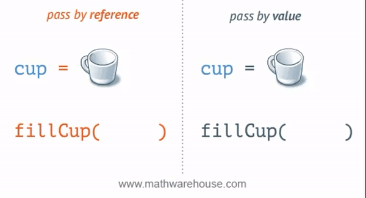

[`Introducción a la Ingeniería de Software`](../README.md) > `Laboratorio 5`

## Laboratorio 5: Paso de Parámetros

### 1. Objetivos :dart:

1. Comprender la diferencia entre parámetro formal y parámetro real.
1. Entender la diferencia entre valor y referencia.
1. Comprender mediante ejemplos las técnicas de paso de parámetros por valor y por referencia.

### 2. Contenido :blue_book:

El paso de parámetros se refiere a la  forma en que se asocian los parámetros reales con los parámetros formales de una función. En __C__ existen dos forma de paso de parámetros: *por valor* y *por referencia*, sin embargo, existen muchos más estilos que se han ido desarrollando a través de los años y que son de gran importancia para el área de Lenguajes de Programación.

---

#### <ins>Paso por valor</ins>

- Hasta ahora, en todos los programas que hemos escrito, hemos estado usando el *paso por valor* que, consiste en asignar una copia del parámetro real al parámetro formal correspondiente.

- Estas copias son iguales en un principio, pero alterar una no afecta a la otra en lo absoluto.

[**`Ejemplo 1`**](ejemplo01/README.md) [**`Actividad 1`**](actividad01/README.md)

---

#### <ins>Paso por referencia</ins>

- A veces es conveniente que la función y la llamada a la misma, no estén aisladas de esta manera. 

- Para esto hay otro tipo de paso de parámetros al que llamamos *paso por referencia*. 

- Con este tipo de paso de parámetros lo que ocurre es que el proceso que vimos en el Ejemplo 1, en vez de copiar el valor de la referencia usa tal cual dicha referencia.

[**`Ejemplo 2`**](ejemplo02/README.md) [**`Actividad 2`**](actividad02/README.md)

---

 

[`Anterior`](../laboratorio04/README.md) | [`Siguiente`](../laboratorio06/README.md)
