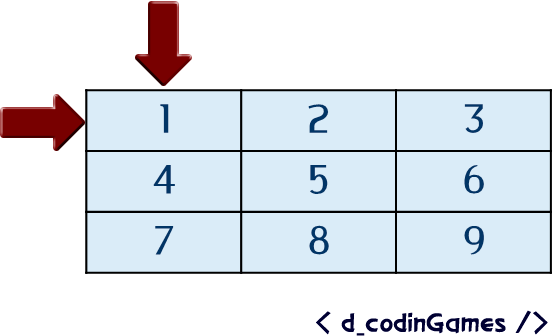

[`Introducción a la Ingeniería de Software`](../README.md) > `Laboratorio 7`

## Laboratorio 7: Matrices


### 1. Objetivos :dart:

1. Estudiar con detalle la definición de arreglo bidimensionales (matrices).

### 2. Contenido :blue_book:

---

#### <ins>Introducción</ins>

- Los arreglos que hemos estudiado hasta ahora son de una dimensión pues únicamente representa un reglón de una tabla.

- En __C__ es posible crear arreglos de más de una dimensión. En particular, los arreglos de dos dimensiones son llamados *matrices*.

- Visualmente, una matriz es una tabla con un número de renglones y columnas variables. En realidad son arreglos que almacenan arreglos.

- Para definir una matriz debemos especificar el número de columnas y renglones usando dos pares de corchetes en este caso. La sintaxis es:

   ```c
   <tipo> <nombre>[<renglones>][<columnas>];
   ```
   
   Por ejemplo, la siguiente instrucción crea un arreglo con tres renglones y dos columnas. Los elementos en este caso son de tipo entero.

   ```c
   int m[3][2];
   ```

- Para inicializar la matriz, usamos ciclos `for` de la misma forma que como hicimos con los arreglos, sin embargo, deben usarse ciclos anidados, uno para recorrer las columnas y otro para los renglonres.

- Para modificar los elementos de una matriz, simplemente indicamos el índice de la columna y renglón. Por ejemplo, para cambiar el elemento en el renglón 0 columna 1 por un valor de 3, escribimos:

   ```c
   m[0][1] = 3;
   ```

   Para obtener el elemento guardado en una determinada celda, usamos:

   ```c
   m[i][j]
   ```

   con `i` y `j` números enteros.

- De esta forma, si queremos llenar una matriz de 3x3 con número del 1 al 9 por ejemplo, escribimos:

   ```c
   int n = 1;

   for (int i = 0; i < 3; i++) // Renglones
   {
      for (int j = 0; j < 3; j++) // Columnas
      {
         m[i][j] = n++;
      }
   }
   ```

   Lo cual creará una matriz con la siguiente forma:

   | 1| 2 | 3|
   |--|--|--|
   | 4| 5 | 6 |
   | 7 | 8 | 9 |

   Visualmente podemos pensar en el recorrido de una matriz así:

   

- También es posible inicializar la matriz colocando los valores explícitamente. Se deben definir los valores de cada renglón entre llaves y separando los elementos por comas y delimitar todos éstos entre llaves. Por ejemplo:

   ```c
   int m[3][2] = {{1,2},{3,4},{5,6}};
   ```

   Lo cual creará una matriz con la siguiente estructura:

   | 1 | 2 |
   |--|--|
   | 3 | 4 |
   | 5 | 6 |


**[`Ejemplo 1`](ejemplo01/README.md)** **[`Actividad 1`](actividad01/README.md)**

---

#### <ins>Funciones sobre matrices</ins>

- La sintaxis para definir funciones sobre matrices es ligeramente distinta a la de los arreglos. Se debe especificar explícitamente el tamaño de las matrices.

- Es posible omitir el tamaño con el uso de apuntadores, mismos que estudiaremos más adelante.

- Al igual que con los arreglos, el tipo de paso de parámetros es por referencia.

**[`Ejemplo 2`](ejemplo02/README.md)** **[`Actividad 2`](actividad02/README.md)**

<br/>

[`Anterior`](../laboratorio06/README.md) | [`Siguiente`](../laboratorio08/README.md)
