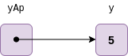
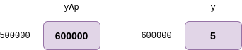

[`Introducción a la Ingeniería de Software`](../README.md) > `Laboratorio 9`

## Laboratorio 9: Apuntadores (I)


### 1. Objetivos :dart:

En este laboratorio comenzaremos el estudio de los apuntadores, esto nos llevará varias sesiones con el plan de cubrir los siguientes objetivos:

1. Aprender lo que es un apuntador y sus operadores.
1. Usar apuntadores para realizar paso por referencia en funciones (repaso).
1. Estudiar la relación que existe los apuntadores, los arreglos y en particular, las cadenas.
1. Usar apuntadores a funciones.
1. Definir y usar arreglos de cadenas.

### 2. Contenido :blue_book:

A lo largo de estas sesiones discuitiremos una de las características más poderosas de __C__, los *apuntadores*, sin embargo, aunque pueden de ser de gran utilidad para definir programas eficientes y robustos, se les debe tener respeto, pues es una idea difícil de abstraer.

Los apuntadores dan pie a escribir programas que, como ya vimos, permiten hacer uso de la técnica de paso por referencia además de permitir la creación y manipulación de estructuras de datos dinámicas, es decir, que pueden crecer y disminuir en tiempo de ejecución (esto se estudia a fondo en el curso de *Estructura de Datos*).

Más adelante, estos conceptos nos permitirán introducir el concepto de *memoria dinámica* así como la definición de *estructuras*.

---

#### <ins>Definición e Inicialización de Variables a Apuntadores</ins>

- Los apuntadores son variables cuyos valores son direcciones en memoria.

- Usualmente, una variable contiene un valor específico, sin embargo los apuntadores contienen la dirección de una variable que a su vez contiene un valor específico.

- En este sentido, el identificador de una variable se refiere *directamente* a un valor, mientras que un apuntador se refiere *indirectamente* a un valor.

   

- Referenciar un valor desde un apuntador se conoce como *indirección*.

- Como todas las variables, los apuntadores deben declararse antes de usarlos, por ejemplo:

   ```c
   int *countAp;
   ```

   define un apuntador llamado `countAp` y apunta a una dirección en memoria que almacena un dato de tipo entero. Siempre que aparezca el símbolo `*` en una declaración de variable indicará que dicha variable es un apuntador y se puede aplicar a cualquier tipo de dato.

- Como puede apreciarse, en el ejemplo anterior, no hemos dado un valor a la variable. Cuando esto ocurre la variable apunta a `NULL` que representa el estado de *apuntar a ningún lugar*, también se puede inicializar explícitamente con 0 con el mismo significado.


---

#### <ins>Operaciones sobre apuntadores</ins>

- El operador `&` también llamado *operador de dirección* es un operador unario que regresa la dirección de su operando. Por ejemplo, supongamos las siguientes definiciones:

   ```c
   int y = 5;
   int *yAp;
   ```

   la siguiente asignación:

   ```c
   yAp = &y;
   ```

   asigna la dirección de la variable `y` a la variable de apuntador `yAp`. Decimos entonces que `yAp` *apunta* a `y`.

   

   <br/>

   

- El operador `*` llamado *operador de indirección* regresa el valor del objeto al que está operando... 

   Por ejemplo, la siguiente instrucción

   ```c
   printf("%d", *yAP);
   ```

   imprime el valor de la variable `y` (5). 

**[`Ejemplo 1`](ejemplo01/README.md)**

---

#### <ins>Precedencia y asociatividad de todos los operadores estudiados hasta el momento</ins>

**Nota:** La precedencia se lee de arriba hacia abajo.

| Operadores | Asociatividad | 
| ---------- | ------------- |
| `() []`    | Izq - Der     | 
| `+ - ++ -- ! * &` | Der - Izq |
| `* / %` | Izq - Der |
| `+ -` | Izq - Der |
| `< <= > >=` | Izq - Der |
| `== !=` | Izq - Der |
| `&&` | Izq - Der |
| `\|\|` | Izq - Der |
| `= += -= *= /= %=` | Der - Izq |
| `,` | Izq - Der |

---

<br/>

[`Anterior`](../laboratorio08/README.md) | [`Siguiente`](../laboratorio10/README.md)
