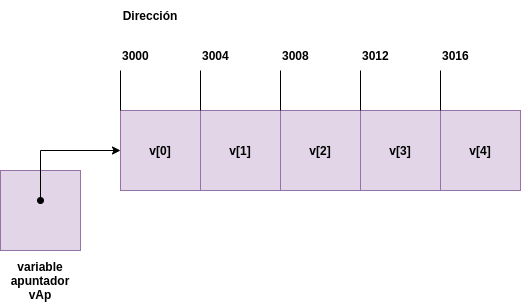
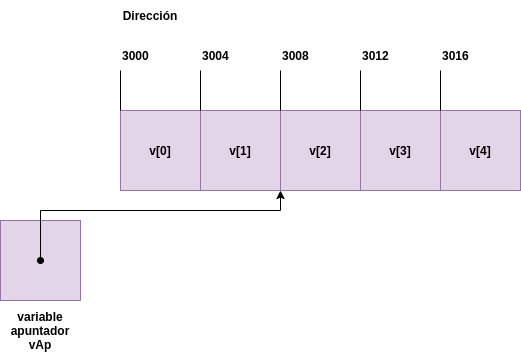

[`Introducción a la Ingeniería de Software`](../README.md) > `Laboratorio 12`

## Laboratorio 12: Expresiones de tipo apuntador y aritmética de apuntadores


### 1. Objetivos :dart:

1. Conocer y ejemplificar la aplicación de distintas operaciones sobre apuntadores.
1. Hacer énfasis en los daños y consecuencias de no usar con precaución los apuntadores.

### 2. Contenido :blue_book:

Los apuntadores son operandos válidos en las expresiones aritméticas, asignaciones y comparaciones. Sin embargo, no todos los operadores que se usan en estas expresiones son válidos en conjunción con las variables definidas como apuntadores. En esta sesión revisaremos los operadores que permiten apuntadores coo operandos y cómo son usadas.

---

#### <ins>Introducción</ins>

- Existe un limitado conjunto de operaciones aritméticas que pueden ser aplicadas a los apuntadores. 

- Un apuntador puede ser incrementado (`++`) o decrementado (`--`).

- Es posible sumar o restar números enteros a un apuntador (`+`, `+=`, `-`, `-=`).

- También es posible restar un apuntador a otro.

---

#### <ins>Operaciones apuntador-entero</ins>

- Supongamos que un arreglo `int v[5]` fue declarado y que su primer elemento se encuentra en la dirección de memoria *3000*. Supongamos también que se tiene un apuntador `vAp` y que éste fue inicializado para apuntar a `v[0]`, es decir, el valor de `vAp` es *3000*. Por ejemplo, suponiendo que realizamos dichas asignaciones en una máquina con enteros de 4-bytes tendríamos:

   

- En general, podríamos definir la variable `vAp` como:

    ```c
    vAp = v;
    ```

    o como:

    ```c
    vAp = &v[0];
    ```

    Esto debido a que por defecto, al referirnos a un arreglo, siempre tenemos un apuntador al primer elemento. Tal y como ocurrió al tratar de obtener el tamaño de un arreglo pasado como argumento en el **[Laboratorio 11](../laboratorio11/README.md)**.

- En la aritmética de números enteros que hemos usado todo este tiempo, si sumamos 3000 + 2, es claro que obtenemos 3002 como resultado. 

- Sin embargo, con los apuntadores la cosa cambia. Cuando un entero es sumado o restado a un apuntador, el apuntador se desplaza a otra dirección de memoria, multiplicando el número a sumar por el tamaño del tipo que está almacenando.

- Por ejemplo, la instrucción:

   ```c
   vAp += 2;
   ```

   producirá *3008* (*3000 + 2 * 4*), asumiendo que la computadora donde ejecutamos el programa tiene enteros de 4-bytes. Es decir, `vAp` ahora apunta a la celda `v[2]`.

   

- Esto aplica en general, con cualquiera de las operaciones que mencionamos en un inicio. Por supuesto con operaciones de sustracción, el apuntador se moverá en dirección opuesta.

---

#### <ins>Operaciones apuntador-apuntador</ins>

- De la misma forma, podemos **restar pero no sumar** apuntadores. 

- Por ejemplo, si `vAp` contiene la dirección *3000* y `v2Ap` contiene la dirección *3008*, la instrucción:

   ```c
   x = v2Ap - vAp;
   ```

   asignará a `x` el número de elementos del arreglo entre `vAp` y `v2Ap`, en este caso 2.

**[`Ejemplo 1`](ejemplo01/README.md)**

---

#### <ins>Observaciones</ins>

- La aritmética de estos ejemplos tiene sentido pues estamos usando un arreglo y como se comentó en algún punto, los arreglos representa celdas *contiguas* de memoria. 

- Efectuar estas operaciones sin estar seguros de que las celdas sean contiguas podría producir errores de lógica o manipular datos que no son los deseados. 

- :warning: **Es de gran importancia usar estas operaciones con mucho cuidado.**

- También es posible usar operadores relacionales.

---

<br/>

[`Anterior`](../laboratorio11/README.md) | [`Siguiente`](../laboratorio13/README.md)
