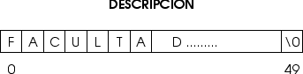

[`Introducción a la Ingeniería de Software`](../README.md) > `Laboratorio 14`

## Laboratorio 14: Manejo de Cadenas `string.h`


### 1. Objetivos :dart:

1. Presentar la primitiva **`const`** y sus principales usos.
1. Conocer las principales funciones de la biblioteca **`string.h`** que permiten trabajar con cadenas.
1. Usar dichas funciones en la solución de problemas.

### 2. Contenido :blue_book:

---

#### <ins>La primitiva `const`</ins> 

- __C__ provee el calificador sobre tipos `const`. Dicho calificador permite prevenir la modificación de los valores de 
un arreglo por medio de una función. 

- De forma tal que los elementos se vuelven constantes y cualquier intento de modificarlos genera un error en tiempo de compilación.

**[`Ejemplo 1`](ejemplo01/README.md)**

---

#### <ins>Manejo de Cadenas</ins>

- Recordemos el Laboratorio 8 en dónde definimos a las cadenas como arreglos de caracteres y dónde ahora sabemos que 
  también pueden ser representadas como apuntadores a un porción de memoria que contiene caracteres.

- Una cadena en __C__ es una secuencia de cero o más caracteres seguidos por un caracter nulo (`NULL`, `\0`).

   

- Es importante preservar el caracter de terminación `NULL` ya que con éste es como __C__ define y maneja las longitudes
  de las cadenas. Todas las funciones de la biblioteca estándar de __C__ lo requieren para una correcta operación.

- En general, a parte de algunas funciones restringidas en longitud (que veremos en breve), al menos que se creen 
  cadenas a mano, no debería haber problemas. Se sugiere usar directamente las funciones para manejo de cadenas que
  provee la biblioteca `string.h` y no tratar de manipular las cadenas a *manita*.

---

#### <ins>Funciones básicas</ins>

- Todas las funciones para manejo de cadenas se incluyen en la biblioteca `string.h`

   ```c
   #include <string.h>
   ```

- Las funciones más comunes son:

   - **`char *strcpy (const char *dest, const char *orig)`**   
   Copia la cadena de caracteres apuntada por `orig` 
   (incluyendo el carácter nulo `\0`) al arreglo apuntado por `dest`. Las cadenas no deben *solaparse*, y la de destino,
   debe ser lo suficientemente grande como para alojar la copia.

   - **`int strcmp (const char *s1, const char *s2)`**   
   Compara las dos cadenas de caracteres `s1` y `s2`. Devuelve un entero menor, igual o mayor que cero si se encuentra que `s1` es, respectivamente, menor que, igual a, o mayor que `s2`.

   - **`char *strerror (int errnum)`**   
   Devuelve un mensaje de error que corresponde a un número de error.

   - **`int strlen (const char *s)`**   
   Calcula la longitud de la cadena de caracteres.

   - **`char *strncat (char *s1, const char *s2, size_t n)`**   
   Agrega `n` caracteres de `s2` a `s1`.

   - **`int strncmp (const char *s1, char *s2, size_t n)`**   
   Compara los primeros `n` caracteres de dos cadenas.

   - **`char *strncpy (const char *s1, const char *s2, size_t n)`**   
   Copia los primeros `n` caracteres de `s2` a `s1`.

   - **`int strcasecmp (const char *s1, const char *s2)`**   
   Versión de `strcmp` que ignora si las letras son mayúsculas o minúsculas.

   - **`int strncasecmp (const char *s1, const char *s2, size_t n)`**   
   Versión de `strcmp` insensible a mayúsculas o minúsculas de que compara los primeros `n` caracteres de `s1`.

- El uso de la mayoría de estas funciones es directo.

   ```c
   char *s1 = "Hola";
   char *s2;
   int longitud;

   longitud = strlen("Hola");
   strcpy(s2,s1);
   ```

- Observar que tanto `strcar` como `strcopy` regresan una copia de su primer argumento, el cual es el arreglo destino.

- Observar también que el orden de los argumentos es: *arreglo destino*, seguido por el *arreglo origen*.

- La función `strcmp` compara *lexicográficamente* las dos cadenas y regresa:

   - *Menor que 0* si `s1` es léxicamente menor que `s2`.
   - *Cero* si `s1` y `s2` son léxicamente iguales.
   - *Mayor que 0* si `s1` es léxicamente mayor que `s2`.

- Las funciones de copiado `strcat`, `strncmp` y `strncpy` son verisones más restringidas que sus contrapartes más 
generales. Realizan una tarea similar, pero solamente para los primeros `n` carácteres.

- Observar que el caracter de terminación podría ser ignorado cuando se usan estas funciones.

   ```c
   char *s1 = "Hola";
   char *s2 = 2;
   int longitud = 2;
   strncpy(s2, s1, longitud); /* s2 = "Ho" */
   ```

   donde `s2` no tiene el terminador `NULL`.

**[`Ejemplo 2`](ejemplo02/README.md)** **[`Ejemplo 3`](ejemplo03/README.md)**

---

[`Anterior`](../laboratorio13/README.md) | [`Siguiente`](../laboratorio15/README.md)
